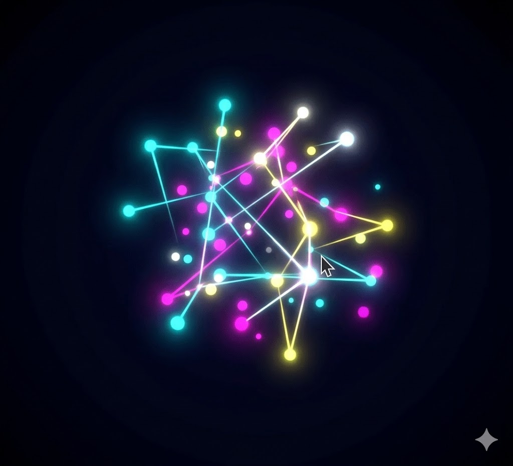

# 🌌 Zodiacus Orionis: Galáxia Interativa


**Zodiacus Orionis** é uma simulação astronômica interativa desenvolvida com **JavaScript Vanilla** e **HTML5 Canvas**. O projeto combina os conceitos de redes neurais dinâmicas com a beleza da astrologia e mecânica orbital, criando um mapa estelar onde 12 constelações e um sistema solar coexistem em movimento perpétuo.

---

## ✨ Demonstração Visual

[-> Clique aqui para navegar pelas estrelas! <-](https://brendowjanuzzi-ui.github.io/arte-generativa-neural/)

<p align="center">
  
</p>

---

## 🚀 Funcionalidades Principais

* **12 Constelações do Zodíaco:** Mapeamento completo das silhuetas de todos os signos, de Áries a Peixes.
* **Mecânica de "Drifting":** As constelações flutuam organicamente pelo espaço, rebatendo suavemente nas bordas da tela.
* **Sistema Solar Orbital:** Simulação de planetas com órbitas elípticas e inclinação 3D, utilizando cálculos trigonométricos.
* **Interatividade Reativa:** Ao passar o mouse (Plexus Effect), as constelações se iluminam, revelam seus nomes e preenchem suas formas com auras coloridas exclusivas.
* **Nuvem Estelar de Fundo:** Um fundo gerado proceduralmente com centenas de estrelas cintilantes para profundidade visual.

---

## 🧠 Desafios Técnicos Superados

Este projeto demonstra domínio em diversas áreas do desenvolvimento Front-End:

1.  **Trigonometria Aplicada:** Uso de `Math.sin()` e `Math.cos()` para criar movimentos orbitais e elipses realistas.
2.  **Manipulação de Canvas API:** Renderização otimizada de múltiplos sistemas (fundo, constelações e planetas) em 60 FPS usando `requestAnimationFrame`.
3.  **Lógica de Colisão e Limites:** Implementação de vetores de velocidade e detecção de bordas para manter os elementos na área visível.
4.  **UI/UX imersiva:** Aplicação de conceitos de *Glassmorphism* e fontes clássicas (`Cinzel`) para criar uma atmosfera mística e moderna.

---

## 🛠️ Tecnologias Utilizadas

* **HTML5:** Estrutura e renderização via elemento `<canvas>`.
* **CSS3:** Estilização de interface e fontes externas via Google Fonts.
* **JavaScript (ES6+):** Lógica de animação, física de partículas e interação com o mouse.

---

## 📁 Como rodar o projeto

1.  Clone este repositório:
    ```bash
    git clone [https://github.com/brendowjanuzzi-ui/arte-generativa-neural.git](https://github.com/brendowjanuzzi-ui/arte-generativa-neural.git)
    ```
2.  Abra o arquivo `index.html` em qualquer navegador moderno.

---

Desenvolvido com 💜 por **Brendow Januzzi**
